# APDS Sequence Diagrams

This document contains comprehensive sequence diagrams for all major use cases and workflows in the APDS (Asset Performance and Data System) project. Each sequence diagram shows the interaction between actors (users, system components) and the flow of operations.

## Table of Contents

1. [User Authentication Sequences](#user-authentication-sequences)
2. [Daily Monitoring Sequences](#daily-monitoring-sequences)
3. [Fault Management Sequences](#fault-management-sequences)
4. [Root Cause Analysis Sequences](#root-cause-analysis-sequences)
5. [Resolution Report Sequences](#resolution-report-sequences)
6. [Escalation Sequences](#escalation-sequences)
7. [Notification Sequences](#notification-sequences)
8. [Performance Report Sequences](#performance-report-sequences)
9. [Data Re-verification Sequences](#data-re-verification-sequences)
10. [Technical Reference Sequences](#technical-reference-sequences)
11. [Documentation Package Sequences](#documentation-package-sequences)
12. [Delivery Verification Sequences](#delivery-verification-sequences)
13. [Vendor Management Sequences](#vendor-management-sequences)
14. [Equipment Management Sequences](#equipment-management-sequences)
15. [View and Reporting Sequences](#view-and-reporting-sequences)

---

## User Authentication Sequences

### 1. User Login Sequence

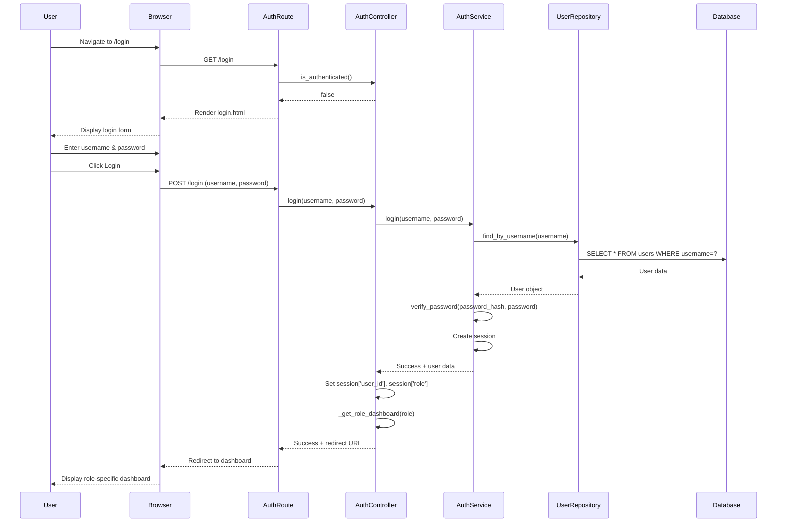
```mermaid
sequenceDiagram
    participant User
    participant Browser
    participant AuthRoute
    participant AuthController
    participant AuthService
    participant UserRepository
    participant Database

    User->>Browser: Navigate to /login
    Browser->>AuthRoute: GET /login
    AuthRoute->>AuthController: is_authenticated()
    AuthController-->>AuthRoute: false
    AuthRoute-->>Browser: Render login.html
    Browser-->>User: Display login form
    
    User->>Browser: Enter username & password
    User->>Browser: Click Login
    Browser->>AuthRoute: POST /login (username, password)
    AuthRoute->>AuthController: login(username, password)
    AuthController->>AuthService: login(username, password)
    AuthService->>UserRepository: find_by_username(username)
    UserRepository->>Database: SELECT * FROM users WHERE username=?
    Database-->>UserRepository: User data
    UserRepository-->>AuthService: User object
    AuthService->>AuthService: verify_password(password_hash, password)
    AuthService->>AuthService: Create session
    AuthService-->>AuthController: Success + user data
    AuthController->>AuthController: Set session['user_id'], session['role']
    AuthController->>AuthController: _get_role_dashboard(role)
    AuthController-->>AuthRoute: Success + redirect URL
    AuthRoute-->>Browser: Redirect to dashboard
    Browser-->>User: Display role-specific dashboard
```

### 2. User Logout Sequence

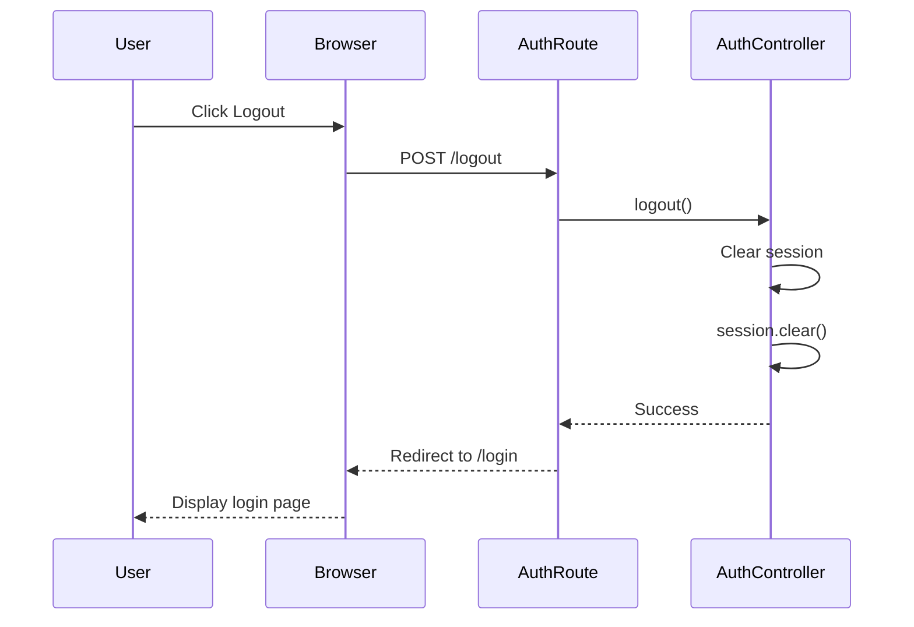
```mermaid
sequenceDiagram
    participant User
    participant Browser
    participant AuthRoute
    participant AuthController

    User->>Browser: Click Logout
    Browser->>AuthRoute: POST /logout
    AuthRoute->>AuthController: logout()
    AuthController->>AuthController: Clear session
    AuthController->>AuthController: session.clear()
    AuthController-->>AuthRoute: Success
    AuthRoute-->>Browser: Redirect to /login
    Browser-->>User: Display login page
```

---

## Daily Monitoring Sequences

### 3. Daily Monitoring Creation Sequence

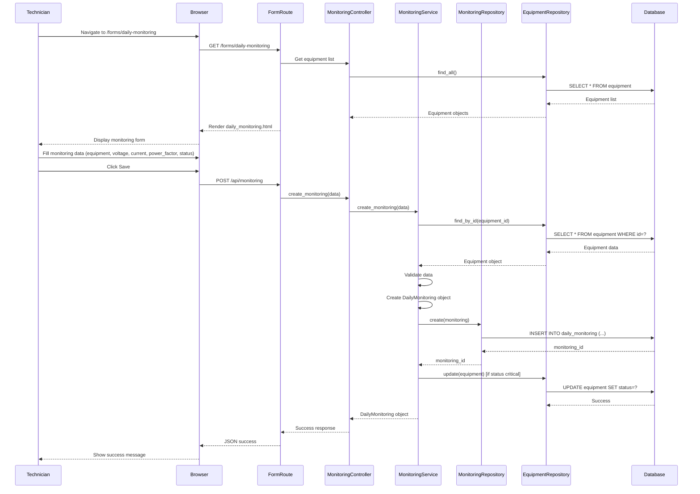
```mermaid
sequenceDiagram
    participant Technician
    participant Browser
    participant FormRoute
    participant MonitoringController
    participant MonitoringService
    participant MonitoringRepository
    participant EquipmentRepository
    participant Database

    Technician->>Browser: Navigate to /forms/daily-monitoring
    Browser->>FormRoute: GET /forms/daily-monitoring
    FormRoute->>MonitoringController: Get equipment list
    MonitoringController->>EquipmentRepository: find_all()
    EquipmentRepository->>Database: SELECT * FROM equipment
    Database-->>EquipmentRepository: Equipment list
    EquipmentRepository-->>MonitoringController: Equipment objects
    FormRoute-->>Browser: Render daily_monitoring.html
    Browser-->>Technician: Display monitoring form
    
    Technician->>Browser: Fill monitoring data (equipment, voltage, current, power_factor, status)
    Technician->>Browser: Click Save
    Browser->>FormRoute: POST /api/monitoring
    FormRoute->>MonitoringController: create_monitoring(data)
    MonitoringController->>MonitoringService: create_monitoring(data)
    MonitoringService->>EquipmentRepository: find_by_id(equipment_id)
    EquipmentRepository->>Database: SELECT * FROM equipment WHERE id=?
    Database-->>EquipmentRepository: Equipment data
    EquipmentRepository-->>MonitoringService: Equipment object
    MonitoringService->>MonitoringService: Validate data
    MonitoringService->>MonitoringService: Create DailyMonitoring object
    MonitoringService->>MonitoringRepository: create(monitoring)
    MonitoringRepository->>Database: INSERT INTO daily_monitoring (...)
    Database-->>MonitoringRepository: monitoring_id
    MonitoringRepository-->>MonitoringService: monitoring_id
    MonitoringService->>EquipmentRepository: update(equipment) [if status critical]
    EquipmentRepository->>Database: UPDATE equipment SET status=?
    Database-->>EquipmentRepository: Success
    MonitoringService-->>MonitoringController: DailyMonitoring object
    MonitoringController-->>FormRoute: Success response
    FormRoute-->>Browser: JSON success
    Browser-->>Technician: Show success message
```

---

## Fault Management Sequences

### 4. Fault Reporting Sequence

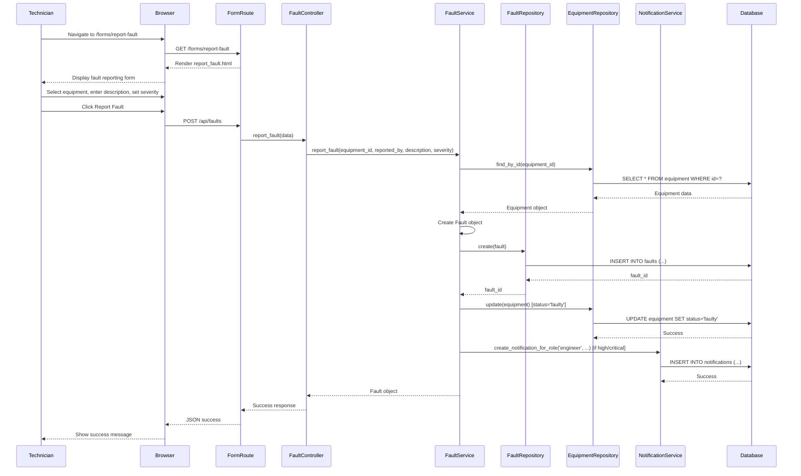
```mermaid
sequenceDiagram
    participant Technician
    participant Browser
    participant FormRoute
    participant FaultController
    participant FaultService
    participant FaultRepository
    participant EquipmentRepository
    participant NotificationService
    participant Database

    Technician->>Browser: Navigate to /forms/report-fault
    Browser->>FormRoute: GET /forms/report-fault
    FormRoute-->>Browser: Render report_fault.html
    Browser-->>Technician: Display fault reporting form
    
    Technician->>Browser: Select equipment, enter description, set severity
    Technician->>Browser: Click Report Fault
    Browser->>FormRoute: POST /api/faults
    FormRoute->>FaultController: report_fault(data)
    FaultController->>FaultService: report_fault(equipment_id, reported_by, description, severity)
    FaultService->>EquipmentRepository: find_by_id(equipment_id)
    EquipmentRepository->>Database: SELECT * FROM equipment WHERE id=?
    Database-->>EquipmentRepository: Equipment data
    EquipmentRepository-->>FaultService: Equipment object
    FaultService->>FaultService: Create Fault object
    FaultService->>FaultRepository: create(fault)
    FaultRepository->>Database: INSERT INTO faults (...)
    Database-->>FaultRepository: fault_id
    FaultRepository-->>FaultService: fault_id
    FaultService->>EquipmentRepository: update(equipment) [status='faulty']
    EquipmentRepository->>Database: UPDATE equipment SET status='faulty'
    Database-->>EquipmentRepository: Success
    FaultService->>NotificationService: create_notification_for_role('engineer', ...) [if high/critical]
    NotificationService->>Database: INSERT INTO notifications (...)
    Database-->>NotificationService: Success
    FaultService-->>FaultController: Fault object
    FaultController-->>FormRoute: Success response
    FormRoute-->>Browser: JSON success
    Browser-->>Technician: Show success message
```

### 5. Fault Status Update Sequence

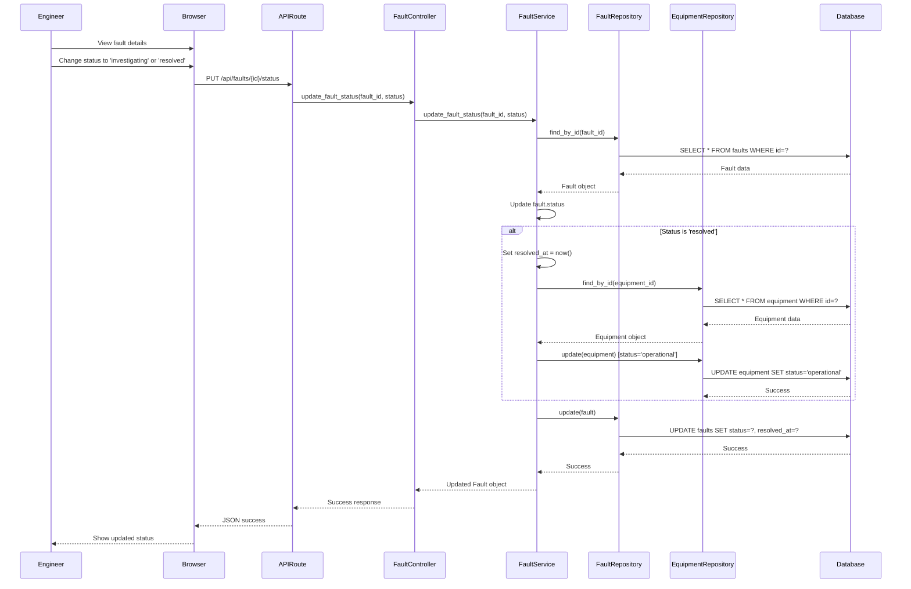
```mermaid
sequenceDiagram
    participant Engineer
    participant Browser
    participant APIRoute
    participant FaultController
    participant FaultService
    participant FaultRepository
    participant EquipmentRepository
    participant Database

    Engineer->>Browser: View fault details
    Engineer->>Browser: Change status to 'investigating' or 'resolved'
    Browser->>APIRoute: PUT /api/faults/{id}/status
    APIRoute->>FaultController: update_fault_status(fault_id, status)
    FaultController->>FaultService: update_fault_status(fault_id, status)
    FaultService->>FaultRepository: find_by_id(fault_id)
    FaultRepository->>Database: SELECT * FROM faults WHERE id=?
    Database-->>FaultRepository: Fault data
    FaultRepository-->>FaultService: Fault object
    FaultService->>FaultService: Update fault.status
    alt Status is 'resolved'
        FaultService->>FaultService: Set resolved_at = now()
        FaultService->>EquipmentRepository: find_by_id(equipment_id)
        EquipmentRepository->>Database: SELECT * FROM equipment WHERE id=?
        Database-->>EquipmentRepository: Equipment data
        EquipmentRepository-->>FaultService: Equipment object
        FaultService->>EquipmentRepository: update(equipment) [status='operational']
        EquipmentRepository->>Database: UPDATE equipment SET status='operational'
        Database-->>EquipmentRepository: Success
    end
    FaultService->>FaultRepository: update(fault)
    FaultRepository->>Database: UPDATE faults SET status=?, resolved_at=?
    Database-->>FaultRepository: Success
    FaultRepository-->>FaultService: Success
    FaultService-->>FaultController: Updated Fault object
    FaultController-->>APIRoute: Success response
    APIRoute-->>Browser: JSON success
    Browser-->>Engineer: Show updated status
```

---

## Root Cause Analysis Sequences

### 6. Root Cause Analysis Creation Sequence

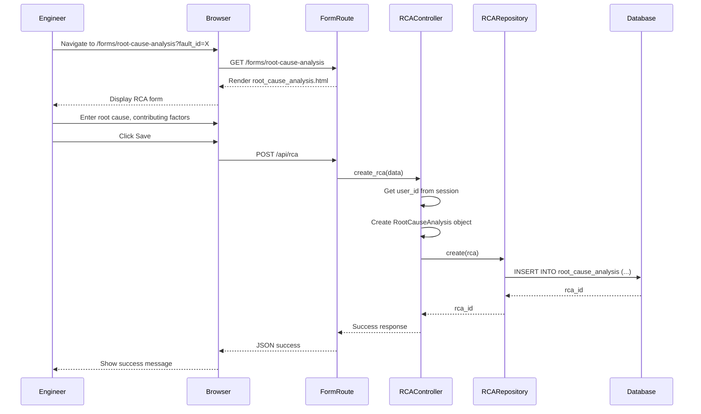
```mermaid
sequenceDiagram
    participant Engineer
    participant Browser
    participant FormRoute
    participant RCAController
    participant RCARepository
    participant Database

    Engineer->>Browser: Navigate to /forms/root-cause-analysis?fault_id=X
    Browser->>FormRoute: GET /forms/root-cause-analysis
    FormRoute-->>Browser: Render root_cause_analysis.html
    Browser-->>Engineer: Display RCA form
    
    Engineer->>Browser: Enter root cause, contributing factors
    Engineer->>Browser: Click Save
    Browser->>FormRoute: POST /api/rca
    FormRoute->>RCAController: create_rca(data)
    RCAController->>RCAController: Get user_id from session
    RCAController->>RCAController: Create RootCauseAnalysis object
    RCAController->>RCARepository: create(rca)
    RCARepository->>Database: INSERT INTO root_cause_analysis (...)
    Database-->>RCARepository: rca_id
    RCARepository-->>RCAController: rca_id
    RCAController-->>FormRoute: Success response
    FormRoute-->>Browser: JSON success
    Browser-->>Engineer: Show success message
```

---

## Resolution Report Sequences

### 7. Resolution Report Creation (Draft) Sequence

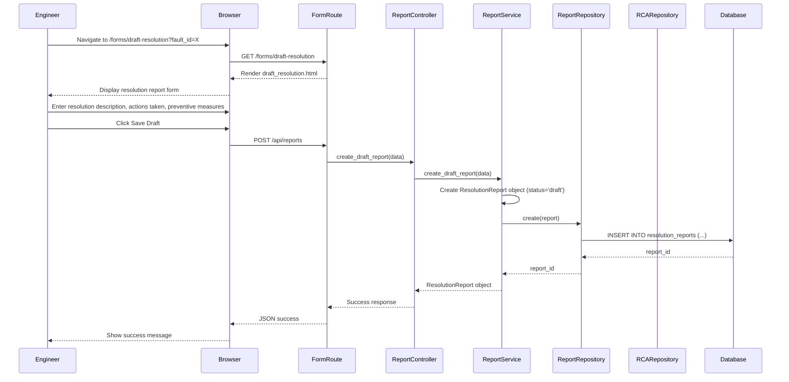
```mermaid
sequenceDiagram
    participant Engineer
    participant Browser
    participant FormRoute
    participant ReportController
    participant ReportService
    participant ReportRepository
    participant RCARepository
    participant Database

    Engineer->>Browser: Navigate to /forms/draft-resolution?fault_id=X
    Browser->>FormRoute: GET /forms/draft-resolution
    FormRoute-->>Browser: Render draft_resolution.html
    Browser-->>Engineer: Display resolution report form
    
    Engineer->>Browser: Enter resolution description, actions taken, preventive measures
    Engineer->>Browser: Click Save Draft
    Browser->>FormRoute: POST /api/reports
    FormRoute->>ReportController: create_draft_report(data)
    ReportController->>ReportService: create_draft_report(data)
    ReportService->>ReportService: Create ResolutionReport object (status='draft')
    ReportService->>ReportRepository: create(report)
    ReportRepository->>Database: INSERT INTO resolution_reports (...)
    Database-->>ReportRepository: report_id
    ReportRepository-->>ReportService: report_id
    ReportService-->>ReportController: ResolutionReport object
    ReportController-->>FormRoute: Success response
    FormRoute-->>Browser: JSON success
    Browser-->>Engineer: Show success message
```

### 8. Resolution Report Submission Sequence

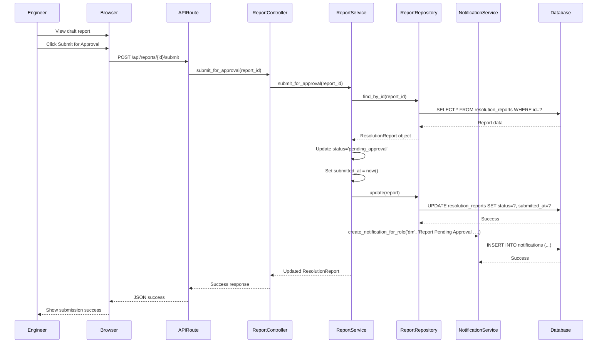
```mermaid
sequenceDiagram
    participant Engineer
    participant Browser
    participant APIRoute
    participant ReportController
    participant ReportService
    participant ReportRepository
    participant NotificationService
    participant Database

    Engineer->>Browser: View draft report
    Engineer->>Browser: Click Submit for Approval
    Browser->>APIRoute: POST /api/reports/{id}/submit
    APIRoute->>ReportController: submit_for_approval(report_id)
    ReportController->>ReportService: submit_for_approval(report_id)
    ReportService->>ReportRepository: find_by_id(report_id)
    ReportRepository->>Database: SELECT * FROM resolution_reports WHERE id=?
    Database-->>ReportRepository: Report data
    ReportRepository-->>ReportService: ResolutionReport object
    ReportService->>ReportService: Update status='pending_approval'
    ReportService->>ReportService: Set submitted_at = now()
    ReportService->>ReportRepository: update(report)
    ReportRepository->>Database: UPDATE resolution_reports SET status=?, submitted_at=?
    Database-->>ReportRepository: Success
    ReportService->>NotificationService: create_notification_for_role('dm', 'Report Pending Approval', ...)
    NotificationService->>Database: INSERT INTO notifications (...)
    Database-->>NotificationService: Success
    ReportService-->>ReportController: Updated ResolutionReport
    ReportController-->>APIRoute: Success response
    APIRoute-->>Browser: JSON success
    Browser-->>Engineer: Show submission success
```

### 9. Resolution Report Approval Sequence

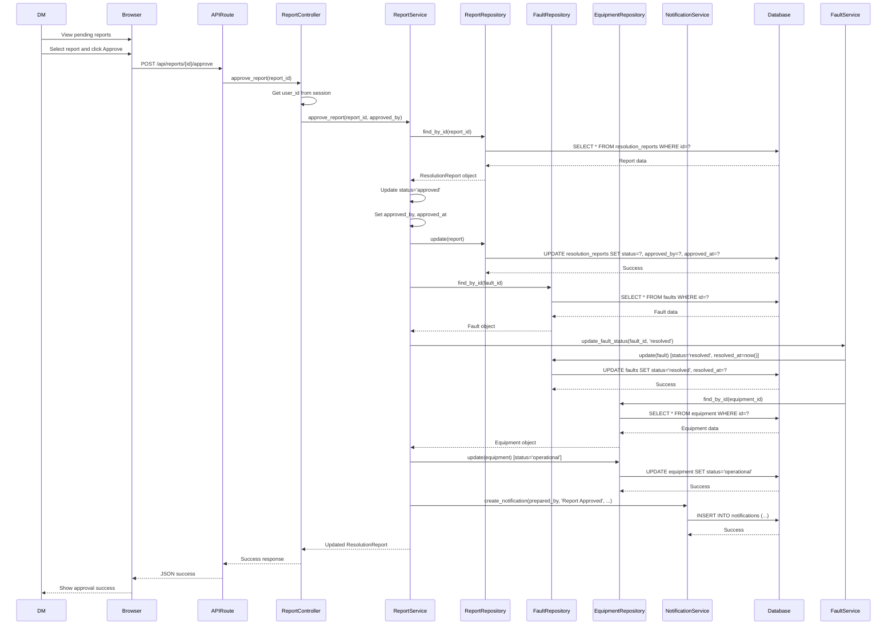
```mermaid
sequenceDiagram
    participant DM
    participant Browser
    participant APIRoute
    participant ReportController
    participant ReportService
    participant ReportRepository
    participant FaultRepository
    participant EquipmentRepository
    participant NotificationService
    participant Database

    DM->>Browser: View pending reports
    DM->>Browser: Select report and click Approve
    Browser->>APIRoute: POST /api/reports/{id}/approve
    APIRoute->>ReportController: approve_report(report_id)
    ReportController->>ReportController: Get user_id from session
    ReportController->>ReportService: approve_report(report_id, approved_by)
    ReportService->>ReportRepository: find_by_id(report_id)
    ReportRepository->>Database: SELECT * FROM resolution_reports WHERE id=?
    Database-->>ReportRepository: Report data
    ReportRepository-->>ReportService: ResolutionReport object
    ReportService->>ReportService: Update status='approved'
    ReportService->>ReportService: Set approved_by, approved_at
    ReportService->>ReportRepository: update(report)
    ReportRepository->>Database: UPDATE resolution_reports SET status=?, approved_by=?, approved_at=?
    Database-->>ReportRepository: Success
    ReportService->>FaultRepository: find_by_id(fault_id)
    FaultRepository->>Database: SELECT * FROM faults WHERE id=?
    Database-->>FaultRepository: Fault data
    FaultRepository-->>ReportService: Fault object
    ReportService->>FaultService: update_fault_status(fault_id, 'resolved')
    FaultService->>FaultRepository: update(fault) [status='resolved', resolved_at=now()]
    FaultRepository->>Database: UPDATE faults SET status='resolved', resolved_at=?
    Database-->>FaultRepository: Success
    FaultService->>EquipmentRepository: find_by_id(equipment_id)
    EquipmentRepository->>Database: SELECT * FROM equipment WHERE id=?
    Database-->>EquipmentRepository: Equipment data
    EquipmentRepository-->>ReportService: Equipment object
    ReportService->>EquipmentRepository: update(equipment) [status='operational']
    EquipmentRepository->>Database: UPDATE equipment SET status='operational'
    Database-->>EquipmentRepository: Success
    ReportService->>NotificationService: create_notification(prepared_by, 'Report Approved', ...)
    NotificationService->>Database: INSERT INTO notifications (...)
    Database-->>NotificationService: Success
    ReportService-->>ReportController: Updated ResolutionReport
    ReportController-->>APIRoute: Success response
    APIRoute-->>Browser: JSON success
    Browser-->>DM: Show approval success
```

---

## Escalation Sequences

### 10. Fault Escalation Sequence

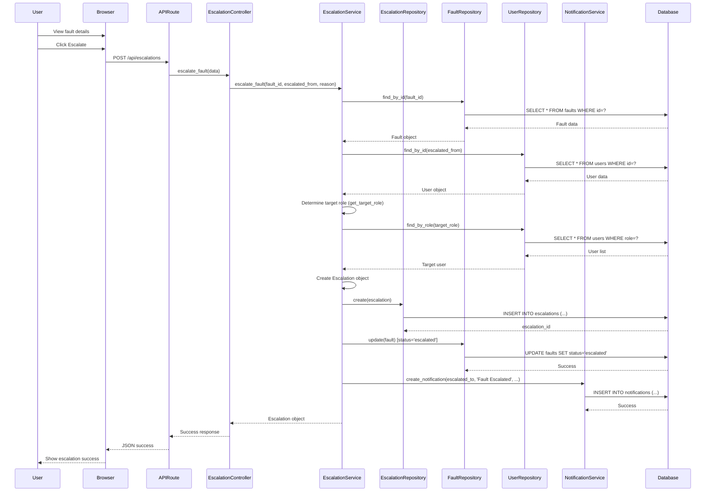
```mermaid
sequenceDiagram
    participant User
    participant Browser
    participant APIRoute
    participant EscalationController
    participant EscalationService
    participant EscalationRepository
    participant FaultRepository
    participant UserRepository
    participant NotificationService
    participant Database

    User->>Browser: View fault details
    User->>Browser: Click Escalate
    Browser->>APIRoute: POST /api/escalations
    APIRoute->>EscalationController: escalate_fault(data)
    EscalationController->>EscalationService: escalate_fault(fault_id, escalated_from, reason)
    EscalationService->>FaultRepository: find_by_id(fault_id)
    FaultRepository->>Database: SELECT * FROM faults WHERE id=?
    Database-->>FaultRepository: Fault data
    FaultRepository-->>EscalationService: Fault object
    EscalationService->>UserRepository: find_by_id(escalated_from)
    UserRepository->>Database: SELECT * FROM users WHERE id=?
    Database-->>UserRepository: User data
    UserRepository-->>EscalationService: User object
    EscalationService->>EscalationService: Determine target role (get_target_role)
    EscalationService->>UserRepository: find_by_role(target_role)
    UserRepository->>Database: SELECT * FROM users WHERE role=?
    Database-->>UserRepository: User list
    UserRepository-->>EscalationService: Target user
    EscalationService->>EscalationService: Create Escalation object
    EscalationService->>EscalationRepository: create(escalation)
    EscalationRepository->>Database: INSERT INTO escalations (...)
    Database-->>EscalationRepository: escalation_id
    EscalationService->>FaultRepository: update(fault) [status='escalated']
    FaultRepository->>Database: UPDATE faults SET status='escalated'
    Database-->>FaultRepository: Success
    EscalationService->>NotificationService: create_notification(escalated_to, 'Fault Escalated', ...)
    NotificationService->>Database: INSERT INTO notifications (...)
    Database-->>NotificationService: Success
    EscalationService-->>EscalationController: Escalation object
    EscalationController-->>APIRoute: Success response
    APIRoute-->>Browser: JSON success
    Browser-->>User: Show escalation success
```

---

## Notification Sequences

### 11. Notification Creation and Reading Sequence

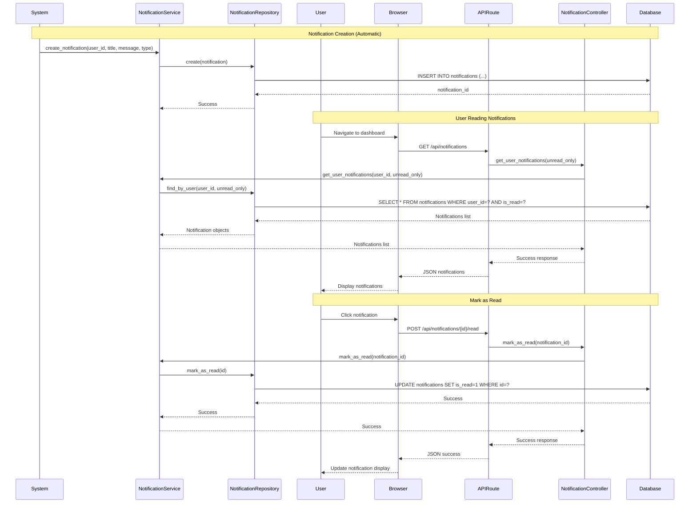
```mermaid
sequenceDiagram
    participant System
    participant NotificationService
    participant NotificationRepository
    participant User
    participant Browser
    participant APIRoute
    participant NotificationController
    participant Database

    Note over System,Database: Notification Creation (Automatic)
    System->>NotificationService: create_notification(user_id, title, message, type)
    NotificationService->>NotificationRepository: create(notification)
    NotificationRepository->>Database: INSERT INTO notifications (...)
    Database-->>NotificationRepository: notification_id
    NotificationRepository-->>NotificationService: Success
    
    Note over User,Database: User Reading Notifications
    User->>Browser: Navigate to dashboard
    Browser->>APIRoute: GET /api/notifications
    APIRoute->>NotificationController: get_user_notifications(unread_only)
    NotificationController->>NotificationService: get_user_notifications(user_id, unread_only)
    NotificationService->>NotificationRepository: find_by_user(user_id, unread_only)
    NotificationRepository->>Database: SELECT * FROM notifications WHERE user_id=? AND is_read=?
    Database-->>NotificationRepository: Notifications list
    NotificationRepository-->>NotificationService: Notification objects
    NotificationService-->>NotificationController: Notifications list
    NotificationController-->>APIRoute: Success response
    APIRoute-->>Browser: JSON notifications
    Browser-->>User: Display notifications
    
    Note over User,Database: Mark as Read
    User->>Browser: Click notification
    Browser->>APIRoute: POST /api/notifications/{id}/read
    APIRoute->>NotificationController: mark_as_read(notification_id)
    NotificationController->>NotificationService: mark_as_read(notification_id)
    NotificationService->>NotificationRepository: mark_as_read(id)
    NotificationRepository->>Database: UPDATE notifications SET is_read=1 WHERE id=?
    Database-->>NotificationRepository: Success
    NotificationRepository-->>NotificationService: Success
    NotificationService-->>NotificationController: Success
    NotificationController-->>APIRoute: Success response
    APIRoute-->>Browser: JSON success
    Browser-->>User: Update notification display
```

---

## Performance Report Sequences

### 12. Performance Report Creation Sequence

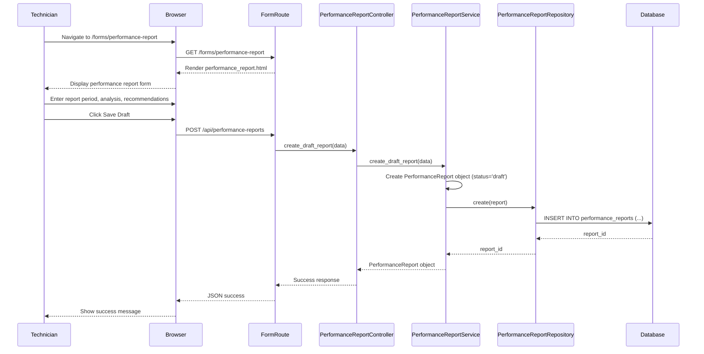
```mermaid
sequenceDiagram
    participant Technician
    participant Browser
    participant FormRoute
    participant PerformanceReportController
    participant PerformanceReportService
    participant PerformanceReportRepository
    participant Database

    Technician->>Browser: Navigate to /forms/performance-report
    Browser->>FormRoute: GET /forms/performance-report
    FormRoute-->>Browser: Render performance_report.html
    Browser-->>Technician: Display performance report form
    
    Technician->>Browser: Enter report period, analysis, recommendations
    Technician->>Browser: Click Save Draft
    Browser->>FormRoute: POST /api/performance-reports
    FormRoute->>PerformanceReportController: create_draft_report(data)
    PerformanceReportController->>PerformanceReportService: create_draft_report(data)
    PerformanceReportService->>PerformanceReportService: Create PerformanceReport object (status='draft')
    PerformanceReportService->>PerformanceReportRepository: create(report)
    PerformanceReportRepository->>Database: INSERT INTO performance_reports (...)
    Database-->>PerformanceReportRepository: report_id
    PerformanceReportRepository-->>PerformanceReportService: report_id
    PerformanceReportService-->>PerformanceReportController: PerformanceReport object
    PerformanceReportController-->>FormRoute: Success response
    FormRoute-->>Browser: JSON success
    Browser-->>Technician: Show success message
```

### 13. Performance Report Compilation Sequence

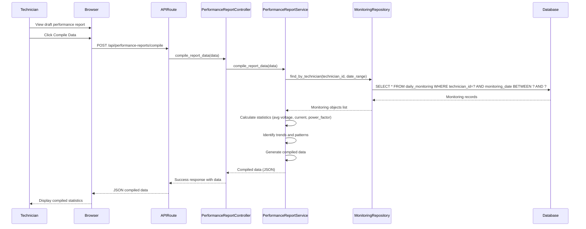
```mermaid
sequenceDiagram
    participant Technician
    participant Browser
    participant APIRoute
    participant PerformanceReportController
    participant PerformanceReportService
    participant MonitoringRepository
    participant Database

    Technician->>Browser: View draft performance report
    Technician->>Browser: Click Compile Data
    Browser->>APIRoute: POST /api/performance-reports/compile
    APIRoute->>PerformanceReportController: compile_report_data(data)
    PerformanceReportController->>PerformanceReportService: compile_report_data(data)
    PerformanceReportService->>MonitoringRepository: find_by_technician(technician_id, date_range)
    MonitoringRepository->>Database: SELECT * FROM daily_monitoring WHERE technician_id=? AND monitoring_date BETWEEN ? AND ?
    Database-->>MonitoringRepository: Monitoring records
    MonitoringRepository-->>PerformanceReportService: Monitoring objects list
    PerformanceReportService->>PerformanceReportService: Calculate statistics (avg voltage, current, power_factor)
    PerformanceReportService->>PerformanceReportService: Identify trends and patterns
    PerformanceReportService->>PerformanceReportService: Generate compiled data
    PerformanceReportService-->>PerformanceReportController: Compiled data (JSON)
    PerformanceReportController-->>APIRoute: Success response with data
    APIRoute-->>Browser: JSON compiled data
    Browser-->>Technician: Display compiled statistics
```

### 14. Performance Report Submission and Approval Sequence

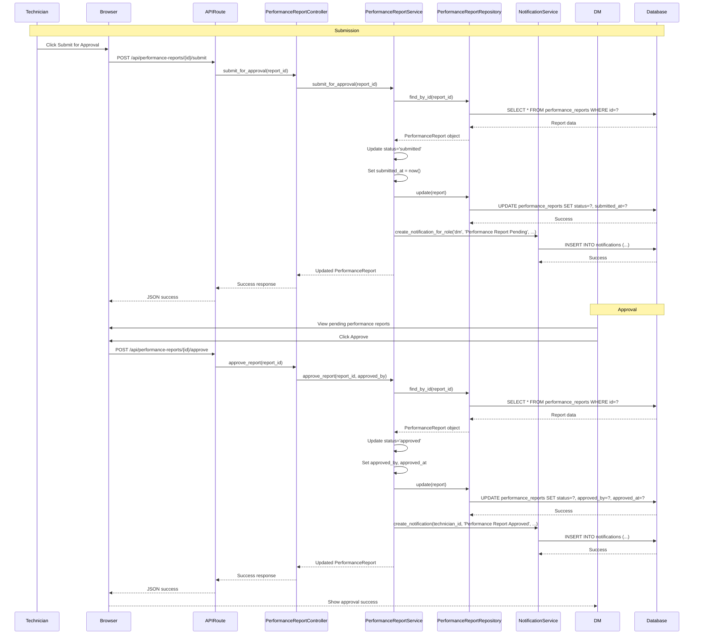
```mermaid
sequenceDiagram
    participant Technician
    participant Browser
    participant APIRoute
    participant PerformanceReportController
    participant PerformanceReportService
    participant PerformanceReportRepository
    participant NotificationService
    participant DM
    participant Database

    Note over Technician,Database: Submission
    Technician->>Browser: Click Submit for Approval
    Browser->>APIRoute: POST /api/performance-reports/{id}/submit
    APIRoute->>PerformanceReportController: submit_for_approval(report_id)
    PerformanceReportController->>PerformanceReportService: submit_for_approval(report_id)
    PerformanceReportService->>PerformanceReportRepository: find_by_id(report_id)
    PerformanceReportRepository->>Database: SELECT * FROM performance_reports WHERE id=?
    Database-->>PerformanceReportRepository: Report data
    PerformanceReportRepository-->>PerformanceReportService: PerformanceReport object
    PerformanceReportService->>PerformanceReportService: Update status='submitted'
    PerformanceReportService->>PerformanceReportService: Set submitted_at = now()
    PerformanceReportService->>PerformanceReportRepository: update(report)
    PerformanceReportRepository->>Database: UPDATE performance_reports SET status=?, submitted_at=?
    Database-->>PerformanceReportRepository: Success
    PerformanceReportService->>NotificationService: create_notification_for_role('dm', 'Performance Report Pending', ...)
    NotificationService->>Database: INSERT INTO notifications (...)
    Database-->>NotificationService: Success
    PerformanceReportService-->>PerformanceReportController: Updated PerformanceReport
    PerformanceReportController-->>APIRoute: Success response
    APIRoute-->>Browser: JSON success
    
    Note over DM,Database: Approval
    DM->>Browser: View pending performance reports
    DM->>Browser: Click Approve
    Browser->>APIRoute: POST /api/performance-reports/{id}/approve
    APIRoute->>PerformanceReportController: approve_report(report_id)
    PerformanceReportController->>PerformanceReportService: approve_report(report_id, approved_by)
    PerformanceReportService->>PerformanceReportRepository: find_by_id(report_id)
    PerformanceReportRepository->>Database: SELECT * FROM performance_reports WHERE id=?
    Database-->>PerformanceReportRepository: Report data
    PerformanceReportRepository-->>PerformanceReportService: PerformanceReport object
    PerformanceReportService->>PerformanceReportService: Update status='approved'
    PerformanceReportService->>PerformanceReportService: Set approved_by, approved_at
    PerformanceReportService->>PerformanceReportRepository: update(report)
    PerformanceReportRepository->>Database: UPDATE performance_reports SET status=?, approved_by=?, approved_at=?
    Database-->>PerformanceReportRepository: Success
    PerformanceReportService->>NotificationService: create_notification(technician_id, 'Performance Report Approved', ...)
    NotificationService->>Database: INSERT INTO notifications (...)
    Database-->>NotificationService: Success
    PerformanceReportService-->>PerformanceReportController: Updated PerformanceReport
    PerformanceReportController-->>APIRoute: Success response
    APIRoute-->>Browser: JSON success
    Browser-->>DM: Show approval success
```

---

## Data Re-verification Sequences

### 15. Data Re-verification Creation Sequence

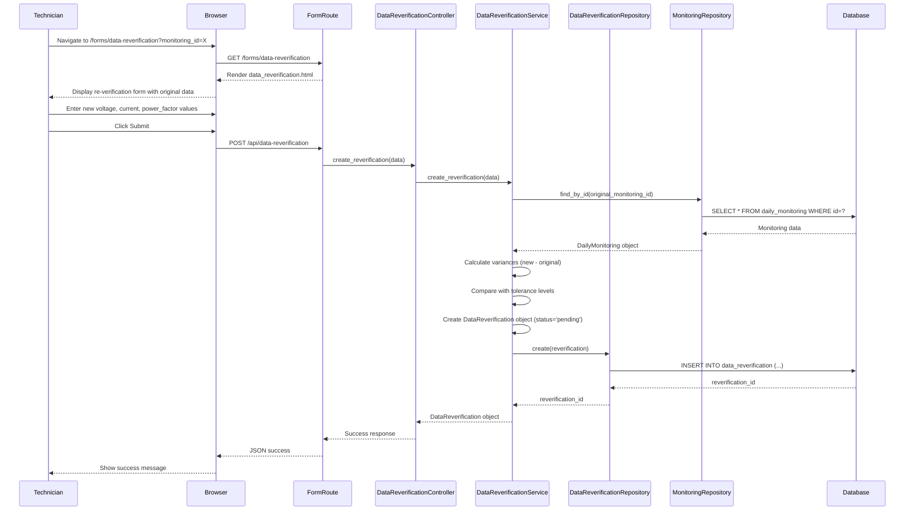
```mermaid
sequenceDiagram
    participant Technician
    participant Browser
    participant FormRoute
    participant DataReverificationController
    participant DataReverificationService
    participant DataReverificationRepository
    participant MonitoringRepository
    participant Database

    Technician->>Browser: Navigate to /forms/data-reverification?monitoring_id=X
    Browser->>FormRoute: GET /forms/data-reverification
    FormRoute-->>Browser: Render data_reverification.html
    Browser-->>Technician: Display re-verification form with original data
    
    Technician->>Browser: Enter new voltage, current, power_factor values
    Technician->>Browser: Click Submit
    Browser->>FormRoute: POST /api/data-reverification
    FormRoute->>DataReverificationController: create_reverification(data)
    DataReverificationController->>DataReverificationService: create_reverification(data)
    DataReverificationService->>MonitoringRepository: find_by_id(original_monitoring_id)
    MonitoringRepository->>Database: SELECT * FROM daily_monitoring WHERE id=?
    Database-->>MonitoringRepository: Monitoring data
    MonitoringRepository-->>DataReverificationService: DailyMonitoring object
    DataReverificationService->>DataReverificationService: Calculate variances (new - original)
    DataReverificationService->>DataReverificationService: Compare with tolerance levels
    DataReverificationService->>DataReverificationService: Create DataReverification object (status='pending')
    DataReverificationService->>DataReverificationRepository: create(reverification)
    DataReverificationRepository->>Database: INSERT INTO data_reverification (...)
    Database-->>DataReverificationRepository: reverification_id
    DataReverificationRepository-->>DataReverificationService: reverification_id
    DataReverificationService-->>DataReverificationController: DataReverification object
    DataReverificationController-->>FormRoute: Success response
    FormRoute-->>Browser: JSON success
    Browser-->>Technician: Show success message
```

### 16. Data Re-verification Approval Sequence

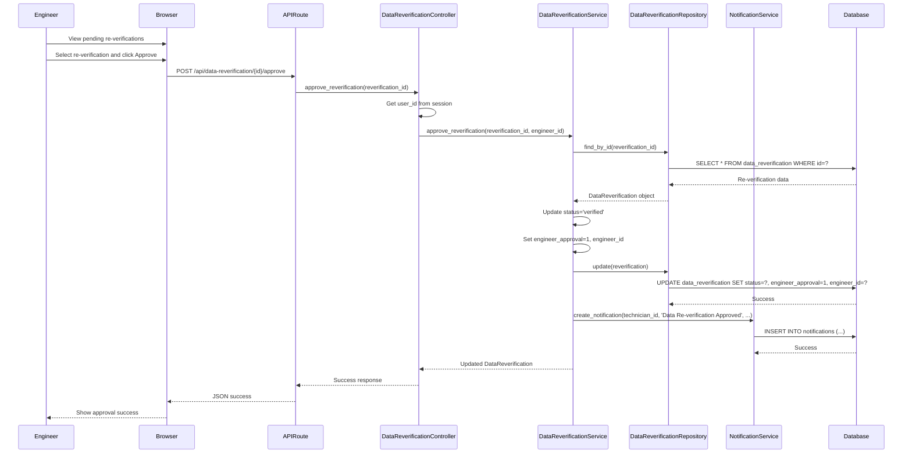
```mermaid
sequenceDiagram
    participant Engineer
    participant Browser
    participant APIRoute
    participant DataReverificationController
    participant DataReverificationService
    participant DataReverificationRepository
    participant NotificationService
    participant Database

    Engineer->>Browser: View pending re-verifications
    Engineer->>Browser: Select re-verification and click Approve
    Browser->>APIRoute: POST /api/data-reverification/{id}/approve
    APIRoute->>DataReverificationController: approve_reverification(reverification_id)
    DataReverificationController->>DataReverificationController: Get user_id from session
    DataReverificationController->>DataReverificationService: approve_reverification(reverification_id, engineer_id)
    DataReverificationService->>DataReverificationRepository: find_by_id(reverification_id)
    DataReverificationRepository->>Database: SELECT * FROM data_reverification WHERE id=?
    Database-->>DataReverificationRepository: Re-verification data
    DataReverificationRepository-->>DataReverificationService: DataReverification object
    DataReverificationService->>DataReverificationService: Update status='verified'
    DataReverificationService->>DataReverificationService: Set engineer_approval=1, engineer_id
    DataReverificationService->>DataReverificationRepository: update(reverification)
    DataReverificationRepository->>Database: UPDATE data_reverification SET status=?, engineer_approval=1, engineer_id=?
    Database-->>DataReverificationRepository: Success
    DataReverificationService->>NotificationService: create_notification(technician_id, 'Data Re-verification Approved', ...)
    NotificationService->>Database: INSERT INTO notifications (...)
    Database-->>NotificationService: Success
    DataReverificationService-->>DataReverificationController: Updated DataReverification
    DataReverificationController-->>APIRoute: Success response
    APIRoute-->>Browser: JSON success
    Browser-->>Engineer: Show approval success
```

---

## Technical Reference Sequences

### 17. Technical Reference Creation Sequence

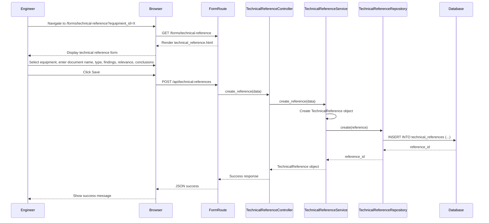
```mermaid
sequenceDiagram
    participant Engineer
    participant Browser
    participant FormRoute
    participant TechnicalReferenceController
    participant TechnicalReferenceService
    participant TechnicalReferenceRepository
    participant Database

    Engineer->>Browser: Navigate to /forms/technical-reference?equipment_id=X
    Browser->>FormRoute: GET /forms/technical-reference
    FormRoute-->>Browser: Render technical_reference.html
    Browser-->>Engineer: Display technical reference form
    
    Engineer->>Browser: Select equipment, enter document name, type, findings, relevance, conclusions
    Engineer->>Browser: Click Save
    Browser->>FormRoute: POST /api/technical-references
    FormRoute->>TechnicalReferenceController: create_reference(data)
    TechnicalReferenceController->>TechnicalReferenceService: create_reference(data)
    TechnicalReferenceService->>TechnicalReferenceService: Create TechnicalReference object
    TechnicalReferenceService->>TechnicalReferenceRepository: create(reference)
    TechnicalReferenceRepository->>Database: INSERT INTO technical_references (...)
    Database-->>TechnicalReferenceRepository: reference_id
    TechnicalReferenceRepository-->>TechnicalReferenceService: reference_id
    TechnicalReferenceService-->>TechnicalReferenceController: TechnicalReference object
    TechnicalReferenceController-->>FormRoute: Success response
    FormRoute-->>Browser: JSON success
    Browser-->>Engineer: Show success message
```

---

## Documentation Package Sequences

### 18. Documentation Package Creation Sequence

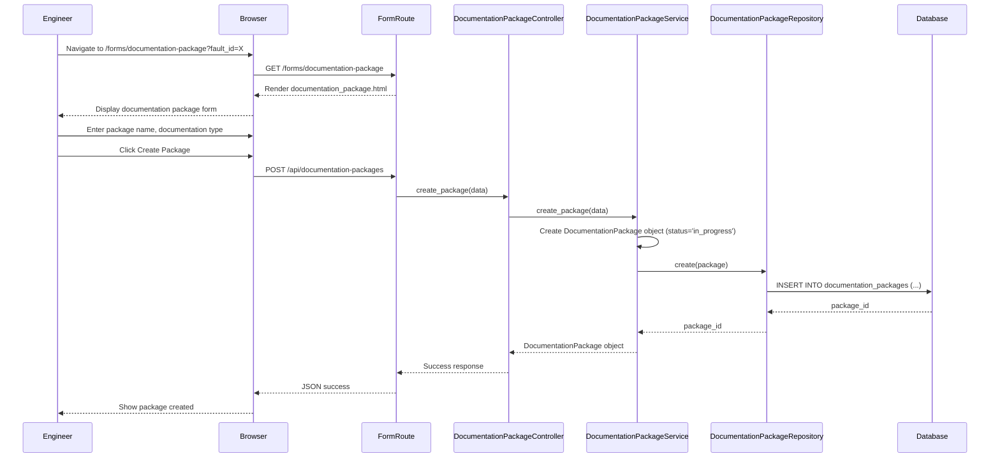
```mermaid
sequenceDiagram
    participant Engineer
    participant Browser
    participant FormRoute
    participant DocumentationPackageController
    participant DocumentationPackageService
    participant DocumentationPackageRepository
    participant Database

    Engineer->>Browser: Navigate to /forms/documentation-package?fault_id=X
    Browser->>FormRoute: GET /forms/documentation-package
    FormRoute-->>Browser: Render documentation_package.html
    Browser-->>Engineer: Display documentation package form
    
    Engineer->>Browser: Enter package name, documentation type
    Engineer->>Browser: Click Create Package
    Browser->>FormRoute: POST /api/documentation-packages
    FormRoute->>DocumentationPackageController: create_package(data)
    DocumentationPackageController->>DocumentationPackageService: create_package(data)
    DocumentationPackageService->>DocumentationPackageService: Create DocumentationPackage object (status='in_progress')
    DocumentationPackageService->>DocumentationPackageRepository: create(package)
    DocumentationPackageRepository->>Database: INSERT INTO documentation_packages (...)
    Database-->>DocumentationPackageRepository: package_id
    DocumentationPackageRepository-->>DocumentationPackageService: package_id
    DocumentationPackageService-->>DocumentationPackageController: DocumentationPackage object
    DocumentationPackageController-->>FormRoute: Success response
    FormRoute-->>Browser: JSON success
    Browser-->>Engineer: Show package created
```

### 19. Documentation Package Item Management Sequence

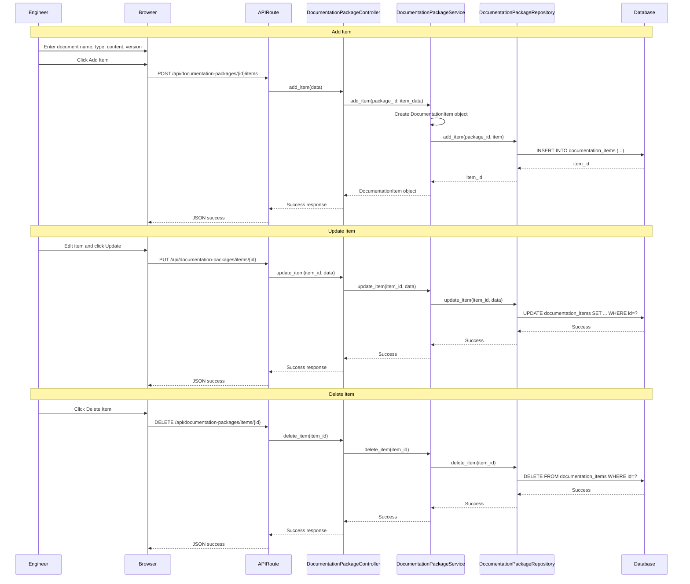
```mermaid
sequenceDiagram
    participant Engineer
    participant Browser
    participant APIRoute
    participant DocumentationPackageController
    participant DocumentationPackageService
    participant DocumentationPackageRepository
    participant Database

    Note over Engineer,Database: Add Item
    Engineer->>Browser: Enter document name, type, content, version
    Engineer->>Browser: Click Add Item
    Browser->>APIRoute: POST /api/documentation-packages/{id}/items
    APIRoute->>DocumentationPackageController: add_item(data)
    DocumentationPackageController->>DocumentationPackageService: add_item(package_id, item_data)
    DocumentationPackageService->>DocumentationPackageService: Create DocumentationItem object
    DocumentationPackageService->>DocumentationPackageRepository: add_item(package_id, item)
    DocumentationPackageRepository->>Database: INSERT INTO documentation_items (...)
    Database-->>DocumentationPackageRepository: item_id
    DocumentationPackageRepository-->>DocumentationPackageService: item_id
    DocumentationPackageService-->>DocumentationPackageController: DocumentationItem object
    DocumentationPackageController-->>APIRoute: Success response
    APIRoute-->>Browser: JSON success
    
    Note over Engineer,Database: Update Item
    Engineer->>Browser: Edit item and click Update
    Browser->>APIRoute: PUT /api/documentation-packages/items/{id}
    APIRoute->>DocumentationPackageController: update_item(item_id, data)
    DocumentationPackageController->>DocumentationPackageService: update_item(item_id, data)
    DocumentationPackageService->>DocumentationPackageRepository: update_item(item_id, data)
    DocumentationPackageRepository->>Database: UPDATE documentation_items SET ... WHERE id=?
    Database-->>DocumentationPackageRepository: Success
    DocumentationPackageRepository-->>DocumentationPackageService: Success
    DocumentationPackageService-->>DocumentationPackageController: Success
    DocumentationPackageController-->>APIRoute: Success response
    APIRoute-->>Browser: JSON success
    
    Note over Engineer,Database: Delete Item
    Engineer->>Browser: Click Delete Item
    Browser->>APIRoute: DELETE /api/documentation-packages/items/{id}
    APIRoute->>DocumentationPackageController: delete_item(item_id)
    DocumentationPackageController->>DocumentationPackageService: delete_item(item_id)
    DocumentationPackageService->>DocumentationPackageRepository: delete_item(item_id)
    DocumentationPackageRepository->>Database: DELETE FROM documentation_items WHERE id=?
    Database-->>DocumentationPackageRepository: Success
    DocumentationPackageRepository-->>DocumentationPackageService: Success
    DocumentationPackageService-->>DocumentationPackageController: Success
    DocumentationPackageController-->>APIRoute: Success response
    APIRoute-->>Browser: JSON success
```

### 20. Documentation Package Completion and Approval Sequence

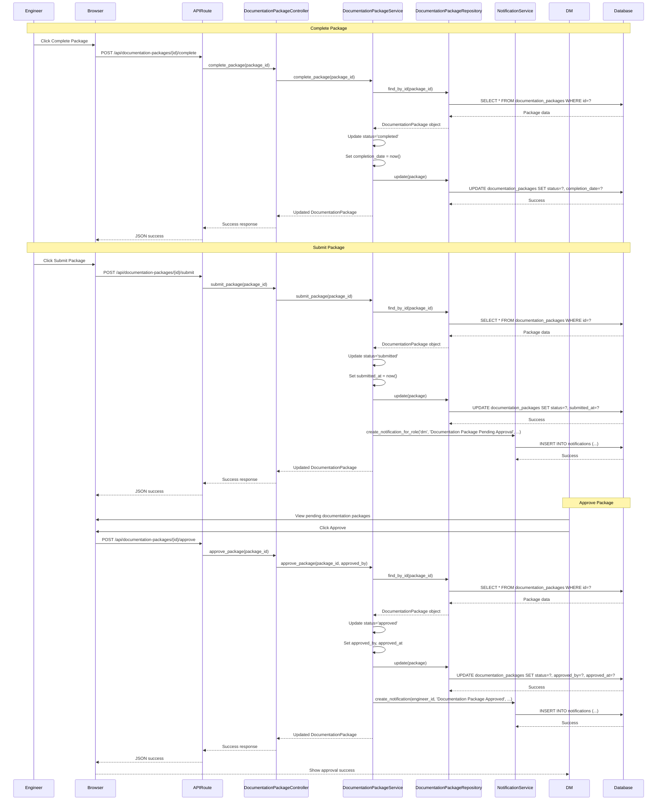
```mermaid
sequenceDiagram
    participant Engineer
    participant Browser
    participant APIRoute
    participant DocumentationPackageController
    participant DocumentationPackageService
    participant DocumentationPackageRepository
    participant NotificationService
    participant DM
    participant Database

    Note over Engineer,Database: Complete Package
    Engineer->>Browser: Click Complete Package
    Browser->>APIRoute: POST /api/documentation-packages/{id}/complete
    APIRoute->>DocumentationPackageController: complete_package(package_id)
    DocumentationPackageController->>DocumentationPackageService: complete_package(package_id)
    DocumentationPackageService->>DocumentationPackageRepository: find_by_id(package_id)
    DocumentationPackageRepository->>Database: SELECT * FROM documentation_packages WHERE id=?
    Database-->>DocumentationPackageRepository: Package data
    DocumentationPackageRepository-->>DocumentationPackageService: DocumentationPackage object
    DocumentationPackageService->>DocumentationPackageService: Update status='completed'
    DocumentationPackageService->>DocumentationPackageService: Set completion_date = now()
    DocumentationPackageService->>DocumentationPackageRepository: update(package)
    DocumentationPackageRepository->>Database: UPDATE documentation_packages SET status=?, completion_date=?
    Database-->>DocumentationPackageRepository: Success
    DocumentationPackageService-->>DocumentationPackageController: Updated DocumentationPackage
    DocumentationPackageController-->>APIRoute: Success response
    APIRoute-->>Browser: JSON success
    
    Note over Engineer,Database: Submit Package
    Engineer->>Browser: Click Submit Package
    Browser->>APIRoute: POST /api/documentation-packages/{id}/submit
    APIRoute->>DocumentationPackageController: submit_package(package_id)
    DocumentationPackageController->>DocumentationPackageService: submit_package(package_id)
    DocumentationPackageService->>DocumentationPackageRepository: find_by_id(package_id)
    DocumentationPackageRepository->>Database: SELECT * FROM documentation_packages WHERE id=?
    Database-->>DocumentationPackageRepository: Package data
    DocumentationPackageRepository-->>DocumentationPackageService: DocumentationPackage object
    DocumentationPackageService->>DocumentationPackageService: Update status='submitted'
    DocumentationPackageService->>DocumentationPackageService: Set submitted_at = now()
    DocumentationPackageService->>DocumentationPackageRepository: update(package)
    DocumentationPackageRepository->>Database: UPDATE documentation_packages SET status=?, submitted_at=?
    Database-->>DocumentationPackageRepository: Success
    DocumentationPackageService->>NotificationService: create_notification_for_role('dm', 'Documentation Package Pending Approval', ...)
    NotificationService->>Database: INSERT INTO notifications (...)
    Database-->>NotificationService: Success
    DocumentationPackageService-->>DocumentationPackageController: Updated DocumentationPackage
    DocumentationPackageController-->>APIRoute: Success response
    APIRoute-->>Browser: JSON success
    
    Note over DM,Database: Approve Package
    DM->>Browser: View pending documentation packages
    DM->>Browser: Click Approve
    Browser->>APIRoute: POST /api/documentation-packages/{id}/approve
    APIRoute->>DocumentationPackageController: approve_package(package_id)
    DocumentationPackageController->>DocumentationPackageService: approve_package(package_id, approved_by)
    DocumentationPackageService->>DocumentationPackageRepository: find_by_id(package_id)
    DocumentationPackageRepository->>Database: SELECT * FROM documentation_packages WHERE id=?
    Database-->>DocumentationPackageRepository: Package data
    DocumentationPackageRepository-->>DocumentationPackageService: DocumentationPackage object
    DocumentationPackageService->>DocumentationPackageService: Update status='approved'
    DocumentationPackageService->>DocumentationPackageService: Set approved_by, approved_at
    DocumentationPackageService->>DocumentationPackageRepository: update(package)
    DocumentationPackageRepository->>Database: UPDATE documentation_packages SET status=?, approved_by=?, approved_at=?
    Database-->>DocumentationPackageRepository: Success
    DocumentationPackageService->>NotificationService: create_notification(engineer_id, 'Documentation Package Approved', ...)
    NotificationService->>Database: INSERT INTO notifications (...)
    Database-->>NotificationService: Success
    DocumentationPackageService-->>DocumentationPackageController: Updated DocumentationPackage
    DocumentationPackageController-->>APIRoute: Success response
    APIRoute-->>Browser: JSON success
    Browser-->>DM: Show approval success
```

---

## Delivery Verification Sequences

### 21. Delivery/Service Verification Creation Sequence

```mermaid
sequenceDiagram
    participant Engineer
    participant Browser
    participant FormRoute
    participant DeliveryVerificationController
    participant DeliveryVerificationService
    participant DeliveryVerificationRepository
    participant Database

    Engineer->>Browser: Navigate to /forms/delivery-verification
    Browser->>FormRoute: GET /forms/delivery-verification
    FormRoute-->>Browser: Render delivery_verification.html
    Browser-->>Engineer: Display verification form
    
    Engineer->>Browser: Select vendor, equipment, verification type, dates, quality assessment
    Engineer->>Browser: Click Save
    Browser->>FormRoute: POST /api/delivery-verification
    FormRoute->>DeliveryVerificationController: create_verification(data)
    DeliveryVerificationController->>DeliveryVerificationService: create_verification(data)
    DeliveryVerificationService->>DeliveryVerificationService: Create DeliveryServiceVerification object (status='pending')
    DeliveryVerificationService->>DeliveryVerificationRepository: create(verification)
    DeliveryVerificationRepository->>Database: INSERT INTO delivery_service_verification (...)
    Database-->>DeliveryVerificationRepository: verification_id
    DeliveryVerificationRepository-->>DeliveryVerificationService: verification_id
    DeliveryVerificationService-->>DeliveryVerificationController: DeliveryServiceVerification object
    DeliveryVerificationController-->>FormRoute: Success response
    FormRoute-->>Browser: JSON success
    Browser-->>Engineer: Show success message
```

### 22. Delivery/Service Verification (DGM Verification) Sequence

```mermaid
sequenceDiagram
    participant DGM
    participant Browser
    participant APIRoute
    participant DeliveryVerificationController
    participant DeliveryVerificationService
    participant DeliveryVerificationRepository
    participant NotificationService
    participant Database

    DGM->>Browser: View pending verifications
    DGM->>Browser: Select verification and enter verification details
    DGM->>Browser: Click Verify
    Browser->>APIRoute: POST /api/delivery-verification/{id}/verify
    APIRoute->>DeliveryVerificationController: verify(verification_id, data)
    DeliveryVerificationController->>DeliveryVerificationController: Get user_id from session
    DeliveryVerificationController->>DeliveryVerificationService: verify(verification_id, data)
    DeliveryVerificationService->>DeliveryVerificationRepository: find_by_id(verification_id)
    DeliveryVerificationRepository->>Database: SELECT * FROM delivery_service_verification WHERE id=?
    Database-->>DeliveryVerificationRepository: Verification data
    DeliveryVerificationRepository-->>DeliveryVerificationService: DeliveryServiceVerification object
    DeliveryVerificationService->>DeliveryVerificationService: Update verification_status='verified'
    DeliveryVerificationService->>DeliveryVerificationService: Set verified_by, verified_at, compliance_status
    DeliveryVerificationService->>DeliveryVerificationRepository: update(verification)
    DeliveryVerificationRepository->>Database: UPDATE delivery_service_verification SET verification_status=?, verified_by=?, verified_at=?, compliance_status=?
    Database-->>DeliveryVerificationRepository: Success
    DeliveryVerificationService->>NotificationService: create_notification(engineer_id, 'Delivery Verified', ...)
    NotificationService->>Database: INSERT INTO notifications (...)
    Database-->>NotificationService: Success
    DeliveryVerificationService-->>DeliveryVerificationController: Updated DeliveryServiceVerification
    DeliveryVerificationController-->>APIRoute: Success response
    APIRoute-->>Browser: JSON success
    Browser-->>DGM: Show verification success
```

---

## Vendor Management Sequences

### 23. Vendor Creation Sequence

```mermaid
sequenceDiagram
    participant Engineer
    participant Browser
    participant FormRoute
    participant VendorController
    participant VendorService
    participant VendorRepository
    participant Database

    Engineer->>Browser: Navigate to /forms/vendor-management
    Browser->>FormRoute: GET /forms/vendor-management
    FormRoute-->>Browser: Render vendor_management.html
    Browser-->>Engineer: Display vendor form
    
    Engineer->>Browser: Enter vendor name, contact info, material list, vendor code
    Engineer->>Browser: Click Save
    Browser->>FormRoute: POST /api/vendors
    FormRoute->>VendorController: create_vendor(data)
    VendorController->>VendorService: create_vendor(data)
    VendorService->>VendorService: Create Vendor object (is_active=true)
    VendorService->>VendorRepository: create(vendor)
    VendorRepository->>Database: INSERT INTO vendors (...)
    Database-->>VendorRepository: vendor_id
    VendorRepository-->>VendorService: vendor_id
    VendorService-->>VendorController: Vendor object
    VendorController-->>FormRoute: Success response
    FormRoute-->>Browser: JSON success
    Browser-->>Engineer: Show success message
```

### 24. Vendor Update and Activation/Deactivation Sequence

```mermaid
sequenceDiagram
    participant Engineer
    participant Browser
    participant APIRoute
    participant VendorController
    participant VendorService
    participant VendorRepository
    participant Database

    Note over Engineer,Database: Update Vendor
    Engineer->>Browser: Edit vendor details
    Engineer->>Browser: Click Update
    Browser->>APIRoute: PUT /api/vendors/{id}
    APIRoute->>VendorController: update_vendor(vendor_id, data)
    VendorController->>VendorService: update_vendor(vendor_id, data)
    VendorService->>VendorRepository: find_by_id(vendor_id)
    VendorRepository->>Database: SELECT * FROM vendors WHERE id=?
    Database-->>VendorRepository: Vendor data
    VendorRepository-->>VendorService: Vendor object
    VendorService->>VendorService: Update vendor fields
    VendorService->>VendorRepository: update(vendor)
    VendorRepository->>Database: UPDATE vendors SET ... WHERE id=?
    Database-->>VendorRepository: Success
    VendorRepository-->>VendorService: Success
    VendorService-->>VendorController: Updated Vendor
    VendorController-->>APIRoute: Success response
    APIRoute-->>Browser: JSON success
    
    Note over Engineer,Database: Deactivate Vendor
    Engineer->>Browser: Click Deactivate
    Browser->>APIRoute: POST /api/vendors/{id}/deactivate
    APIRoute->>VendorController: deactivate_vendor(vendor_id)
    VendorController->>VendorService: deactivate_vendor(vendor_id)
    VendorService->>VendorRepository: deactivate(vendor_id)
    VendorRepository->>Database: UPDATE vendors SET is_active=0 WHERE id=?
    Database-->>VendorRepository: Success
    VendorRepository-->>VendorService: Success
    VendorService-->>VendorController: Updated Vendor
    VendorController-->>APIRoute: Success response
    APIRoute-->>Browser: JSON success
    
    Note over Engineer,Database: Activate Vendor
    Engineer->>Browser: Click Activate
    Browser->>APIRoute: POST /api/vendors/{id}/activate
    APIRoute->>VendorController: activate_vendor(vendor_id)
    VendorController->>VendorService: activate_vendor(vendor_id)
    VendorService->>VendorRepository: activate(vendor_id)
    VendorRepository->>Database: UPDATE vendors SET is_active=1 WHERE id=?
    Database-->>VendorRepository: Success
    VendorRepository-->>VendorService: Success
    VendorService-->>VendorController: Updated Vendor
    VendorController-->>APIRoute: Success response
    APIRoute-->>Browser: JSON success
```

---

## Equipment Management Sequences

### 25. Equipment Status Viewing Sequence

```mermaid
sequenceDiagram
    participant User
    participant Browser
    participant FormRoute
    participant EquipmentController
    participant EquipmentRepository
    participant Database

    User->>Browser: Navigate to /forms/equipment-status
    Browser->>FormRoute: GET /forms/equipment-status
    FormRoute->>EquipmentController: get_all_equipment()
    EquipmentController->>EquipmentRepository: find_all()
    EquipmentRepository->>Database: SELECT * FROM equipment ORDER BY equipment_code
    Database-->>EquipmentRepository: Equipment list
    EquipmentRepository-->>EquipmentController: Equipment objects list
    EquipmentController-->>FormRoute: Success response with equipment list
    FormRoute-->>Browser: Render equipment_status.html with equipment data
    Browser-->>User: Display equipment table with status
```

---

## View and Reporting Sequences

### 26. Monitoring History Viewing Sequence

```mermaid
sequenceDiagram
    participant Technician
    participant Browser
    participant ViewRoute
    participant MonitoringController
    participant MonitoringService
    participant MonitoringRepository
    participant Database

    Technician->>Browser: Navigate to /views/monitoring-history
    Browser->>ViewRoute: GET /views/monitoring-history
    ViewRoute-->>Browser: Render monitoring_history.html
    Browser-->>Technician: Display monitoring history page
    
    Note over Browser,Database: Load History via API
    Browser->>Browser: JavaScript: fetch('/api/monitoring/technician')
    Browser->>ViewRoute: GET /api/monitoring/technician?limit=100
    ViewRoute->>MonitoringController: get_technician_history(limit)
    MonitoringController->>MonitoringController: Get user_id from session
    MonitoringController->>MonitoringService: get_technician_history(technician_id, limit)
    MonitoringService->>MonitoringRepository: find_by_technician(technician_id, limit)
    MonitoringRepository->>Database: SELECT * FROM daily_monitoring WHERE technician_id=? ORDER BY monitoring_date DESC LIMIT ?
    Database-->>MonitoringRepository: Monitoring records
    MonitoringRepository-->>MonitoringService: Monitoring objects list
    MonitoringService-->>MonitoringController: Monitoring list
    MonitoringController-->>ViewRoute: Success response
    ViewRoute-->>Browser: JSON monitoring data
    Browser-->>Technician: Display monitoring history table
```

### 27. Fault List Viewing Sequence

```mermaid
sequenceDiagram
    participant User
    participant Browser
    participant ViewRoute
    participant FaultController
    participant FaultService
    participant FaultRepository
    participant Database

    User->>Browser: Navigate to /views/fault-list
    Browser->>ViewRoute: GET /views/fault-list
    ViewRoute-->>Browser: Render fault_list.html
    Browser-->>User: Display fault list page
    
    Note over Browser,Database: Load Faults via API
    Browser->>Browser: JavaScript: fetch('/api/faults')
    Browser->>ViewRoute: GET /api/faults?limit=100
    ViewRoute->>FaultController: get_all_faults(limit)
    FaultController->>FaultService: get_all_faults(limit)
    FaultService->>FaultRepository: find_all(limit)
    FaultRepository->>Database: SELECT * FROM faults ORDER BY reported_at DESC LIMIT ?
    Database-->>FaultRepository: Fault records
    FaultRepository-->>FaultService: Fault objects list
    FaultService-->>FaultController: Fault list
    FaultController-->>ViewRoute: Success response
    ViewRoute-->>Browser: JSON fault data
    Browser-->>User: Display fault list table
```

### 28. Report Review Viewing Sequence

```mermaid
sequenceDiagram
    participant DM
    participant Browser
    participant ViewRoute
    participant ReportController
    participant ReportService
    participant ReportRepository
    participant Database

    DM->>Browser: Navigate to /views/report-review
    Browser->>ViewRoute: GET /views/report-review
    ViewRoute-->>Browser: Render report_review.html
    Browser-->>DM: Display report review page
    
    Note over Browser,Database: Load Pending Reports via API
    Browser->>Browser: JavaScript: fetch('/api/reports/pending')
    Browser->>ViewRoute: GET /api/reports/pending
    ViewRoute->>ReportController: get_all_pending_reports()
    ReportController->>ReportService: get_all_pending_reports()
    ReportService->>ReportRepository: find_pending_approval()
    ReportRepository->>Database: SELECT * FROM resolution_reports WHERE status='pending_approval' ORDER BY submitted_at DESC
    Database-->>ReportRepository: Report records
    ReportRepository-->>ReportService: ResolutionReport objects list
    ReportService-->>ReportController: Report list
    ReportController-->>ViewRoute: Success response
    ViewRoute-->>Browser: JSON report data
    Browser-->>DM: Display pending reports table
```

---

## Summary

This document contains **28 comprehensive sequence diagrams** covering all major workflows in the APDS system:

1. **Authentication**: Login, Logout
2. **Daily Monitoring**: Creation
3. **Fault Management**: Reporting, Status Updates
4. **Root Cause Analysis**: Creation
5. **Resolution Reports**: Creation, Submission, Approval
6. **Escalation**: Fault Escalation
7. **Notifications**: Creation, Reading, Marking as Read
8. **Performance Reports**: Creation, Compilation, Submission, Approval
9. **Data Re-verification**: Creation, Approval
10. **Technical References**: Creation
11. **Documentation Packages**: Creation, Item Management, Completion, Submission, Approval
12. **Delivery Verification**: Creation, DGM Verification
13. **Vendor Management**: Creation, Update, Activation/Deactivation
14. **Equipment Management**: Status Viewing
15. **Views**: Monitoring History, Fault List, Report Review

Each sequence diagram shows the complete flow from user interaction through the controller, service, repository layers to the database, and back. The diagrams illustrate the interaction patterns and data flow for each use case in the system.

