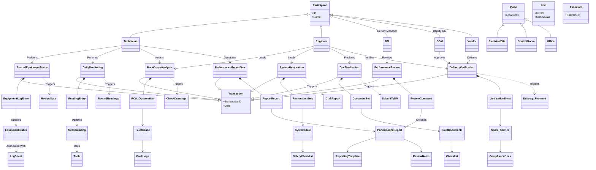

```mermaid
classDiagram
    %% --- Abstract Classes (The Pattern) ---
    class Participant {
        +ID
        +Name
    }
    class Place {
        +LocationID
    }
    class Transaction {
        +TransactionID
        +Date
    }
    class Item {
        +ItemID
        +Status/Data
    }
    class Associate {
        +Note/DocID
    }

    %% --- Inheritance Relationships ---
    Participant <|-- Technician
    Participant <|-- Engineer
    Participant <|-- DM : Deputy Manager
    Participant <|-- DGM : Deputy GM
    Participant <|-- Vendor

    Place <|-- ElectricalSite
    Place <|-- ControlRoom
    Place <|-- Office

    %% --- 1. MONITORING & STATUS DOMAIN ---
    Technician --> RecordEquipmentStatus : Performs
    Technician --> DailyMonitoring : Performs
    
    RecordEquipmentStatus --|> Transaction
    DailyMonitoring --|> Transaction

    RecordEquipmentStatus *-- EquipmentLogEntry
    DailyMonitoring *-- ReadingEntry

    EquipmentLogEntry --> EquipmentStatus : Updates
    ReadingEntry --> MeterReading : Updates

    EquipmentStatus --> LogSheet : Associated With
    MeterReading --> Tools : Uses

    %% --- 2. ANALYSIS & RESTORATION DOMAIN ---
    Engineer --> RootCauseAnalysis : Leads
    Technician --> RootCauseAnalysis : Assists
    Engineer --> SystemRestoration : Leads
    
    RootCauseAnalysis --|> Transaction
    SystemRestoration --|> Transaction

    RootCauseAnalysis *-- RCA_Observation
    SystemRestoration *-- RestorationStep

    RCA_Observation --> FaultCause
    RestorationStep --> SystemState

    FaultCause --> FaultLogs
    SystemState --> SafetyChecklist

    %% --- 3. REPORTING & REVIEW DOMAIN ---
    DM --> PerformanceReview : Reviews
    Technician --> PerformanceReportGen : Generates
    Engineer --> DocFinalization : Finalizes
    
    PerformanceReview --|> Transaction
    PerformanceReportGen --|> Transaction
    DocFinalization --|> Transaction

    PerformanceReportGen *-- ReportRecord
    PerformanceReview *-- ReviewComment
    DocFinalization *-- DocumentSet

    ReportRecord --> PerformanceReport
    ReviewComment --> PerformanceReport : Critiques
    DocumentSet --> FaultDocuments

    PerformanceReport --> ReportingTemplate
    PerformanceReport --> ReviewNotes
    FaultDocuments --> Checklist

    %% --- 4. SUPPLY CHAIN DOMAIN ---
    Vendor --> DeliveryVerification : Delivers
    Engineer --> DeliveryVerification : Verifies
    DGM --> DeliveryVerification : Approves
    
    DeliveryVerification --|> Transaction
    DeliveryVerification *-- VerificationEntry
    VerificationEntry --> Spare_Service
    Spare_Service --> ComplianceDocs

    %% --- SUBSEQUENT TRANSACTIONS (Triggers) ---
    DailyMonitoring ..> RecordReadings : Triggers
    RecordEquipmentStatus ..> ReviewData : Triggers
    RootCauseAnalysis ..> CheckDrawings : Triggers
    SystemRestoration ..> DraftReport : Triggers
    DocFinalization ..> SubmitToDM : Triggers
    DeliveryVerification ..> Delivery_Payment : Triggers
```